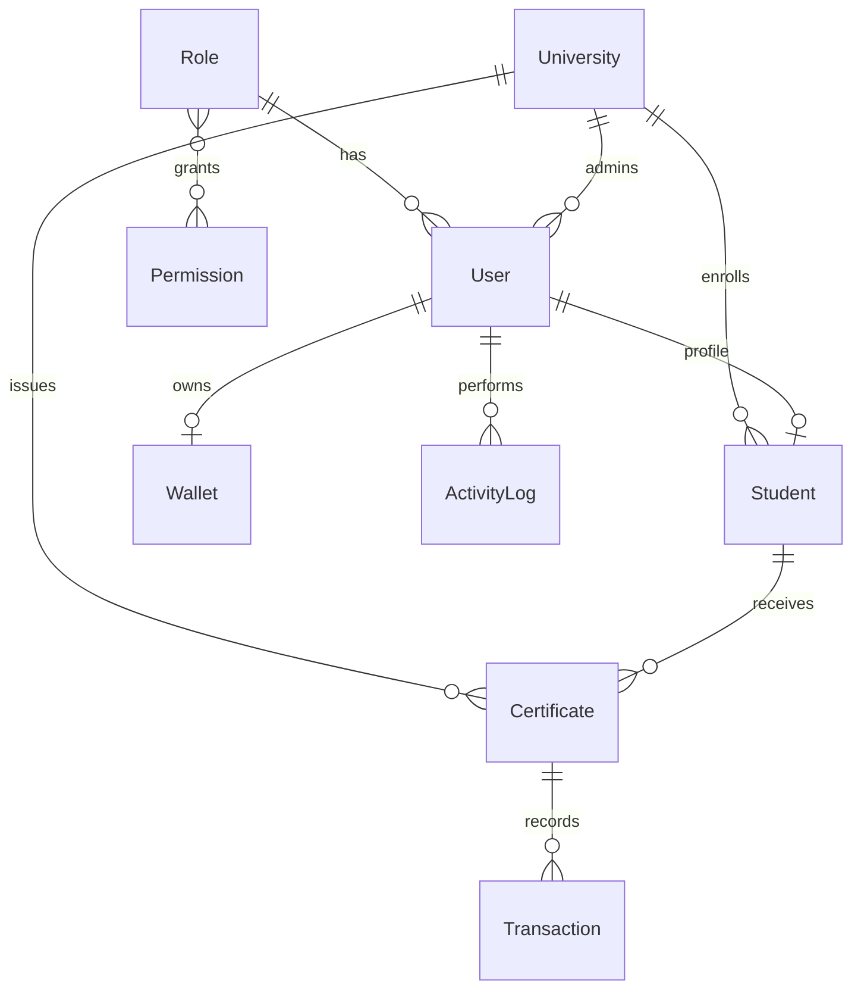

# Database Schema & ER Diagram

## Entity relationship (logical)

## Tables

| Table | Purpose |
|-------|---------|
| `roles` | SUPER_ADMIN, UNIVERSITY_ADMIN, STUDENT, EMPLOYER |
| `permissions` | Fine-grained permission catalog |
| `users` | Auth identities (email / Google / MetaMask) |
| `universities` | Issuing institutions + logos |
| `students` | Student records per university |
| `certificates` | PDF, IPFS hashes, tokenId, tx hash, status |
| `wallets` | Linked EVM addresses + SIWE nonce |
| `transactions` | Mint / transfer / revoke on-chain records |
| `activity_logs` | Audit trail |

## Certificate status machine

`DRAFT` → `GENERATED` → `UPLOADED_IPFS` → `MINTED` → (`REVOKED`)

## Indexes

Email, role, university, student name, certificate number, tokenId, transaction hash, and status are indexed for list/search performance.

## Prisma location

Schema: [`prisma/schema.prisma`](../prisma/schema.prisma)  
Seed: [`prisma/seed.ts`](../prisma/seed.ts)
